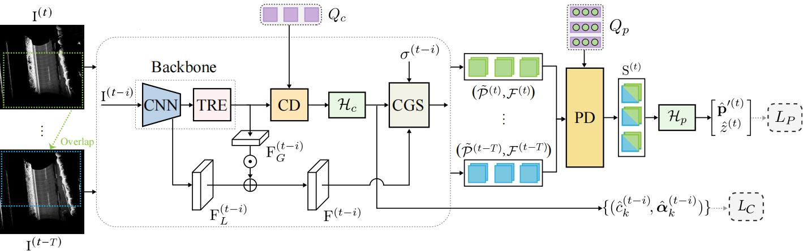
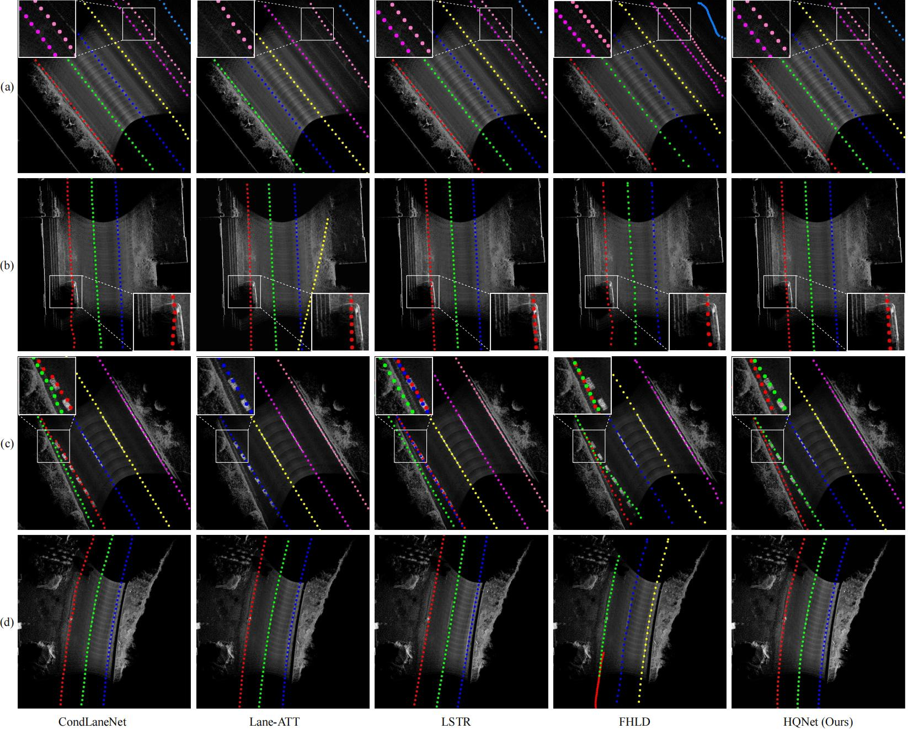

<div align="center">
<h1>HQNet</h1>

**Hierarchical Queries for 3D Lane Detection Based on Multi-Frame Point Clouds**
</div>


## Introduction
3D lane detection based on multi-frame point clouds is a critical task for autonomous driving. The challenge lies in efficiently performing temporal fusion using multiple data frames with incomplete yet complementary contexts.
Existing methods either directly concatenate consecutive frames, avoiding the intrinsic limitations of the raw data, or fuse entire feature maps, without distinguishing lane-related features from backgrounds. These solutions exhibit room for improvement in both precision and efficiency.
In this paper, we propose an end-to-end lane detection network with hierarchical queries, which decodes lane features at different levels in a top-down manner for high-precision localization. This framework can be deployed on multi-frame inputs, as it efficiently achieves lane-related sequence fusion with reduced computational costs and improved inference speed.
To be specific, we design semi-parametric lane geometry representations to model lanes as parametric curves and discrete points. Accordingly, hierarchical queries are proposed to focus on the two-level lane geometries, including curve queries and point queries. Curve queries capture the global structure of lanes projected onto the bird’s-eye-view flat ground, while point queries aggregate multi-frame sequences obtained through curve-guided sampling, acquiring comprehensive and reliable point-level features. 
In the training stage, the curve matching and point localization loss optimizes the detected lane geometries at both levels. Experiments conducted on our self-collected MultiBEV dataset validate that our method outperforms previously published single-frame and multi-frame methods. 



## Prepare Dataset
Prepare your own 3D LiDAR point cloud dataset. 

Dataset directory structure:
```
MultiBEV/
|---samples/
|   |---multibev_train_samples.pkl
|   |---multibev_test_samples.pkl
|---gt/
|   |---[your_task_name]![your_split_name]![your_sample_name].txt
|---json_gt/
|   |---[your_task_name]![your_split_name]![your_sample_name]_gt.json
original_data/
|---your_task_name/
|   |---[your_split_name]/
|   |   |---bev_fmap_tan_0/
|   |   |   |---[your_sample_name].npy
|   |   |---bev_fmap_tan_90/
|   |   |   |---[your_sample_name].npy
|   |   |---bev_seg_map/
|   |   |   |---[your_sample_name].jpg
```
[your_sample_name].npy is a multi-channel BEV image, encoding the mean intensity, density, height difference, and minimum height, etc.

For training, GT is organized in txt format:
```
x1 y1 z1 node_type1 instance1 ... x2 y2 z2 node_type2 instance2 track_x track_y track_z tan_indicator sample_weight
```
In our codes, tan_indicator is set as 0 or 1.63e+16 to guarantee the direction of roads. Besides, sample_weight is set as 0, serving as a placeholder.

For evaluation, GT is organized in json format:
```
{"task_name": "[your_task_name]![your_split_name]![your_sample_name].npy", "lane_mark": [{"node_list": [[x1, y1, z1], ...], "index": idx, "acce_line_info": "x", "lane_mark_type": "x", "lane_mark_color": "x", "index_uniq": "x"}, ...]}
```
In our codes, "acce_line_info": "x", "lane_mark_type": "x", "lane_mark_color": "x", "index_uniq": "x" are placeholders. You can customize them.

## Set Environment
Create your conda virtual environment, activate it, and install requirements.
```
conda create -n hqnet python=3.8.0 -y
conda activate hqnet
pip install -r requirements.txt
```

## Training
Train HQNet with 1 GPU:
```
python main.py
```

## Evaluation
```
python main.py --test --load_from 'model_path/HQNet.pkl'
```
https://drive.google.com/file/d/1BuXXAG4ABkpbiHP_61tPZ1vmsC1dGav7/view?usp=drive_link

## Qualitative results



## Acknowledgements

[DETR](https://github.com/facebookresearch/detr)

[LSTR](https://github.com/liuruijin17/LSTR)

[FHLD](https://github.com/Doo-do/FHLD)
